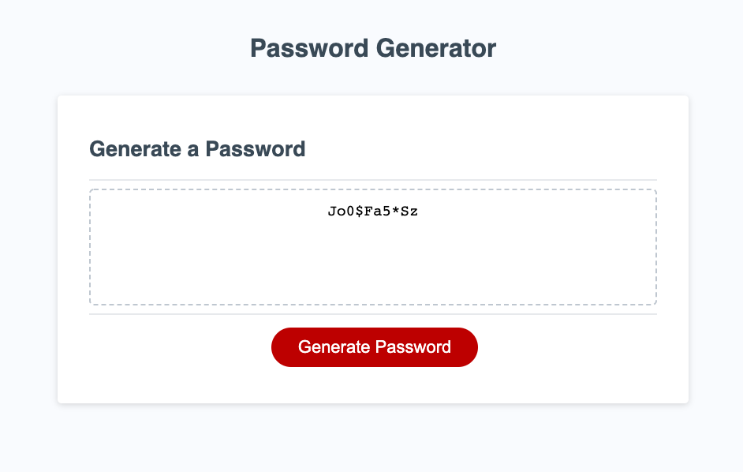

# Title of Project

## Description

> Here is a password generator for the security conscious individual looking to curate a strong password. The simple pages walks the user through a series of prompts to specify the type of characters the user would like in the password, as well as the password length. Then, the program will automatically generate a password to the users specifications. 

## Deployment

> Merely open the index.html file in any brower for immediate functionality. Also deployable to Github pages. 

## Features

> Allows the user to configure the password to inlude the following: Upper Case Letters, Lower Case Letters, Special Characters, and Numerica Characters. Also allows the user to designate the password length on a scale of 8 to 128 characters. 

## Images

> 
>
> 
